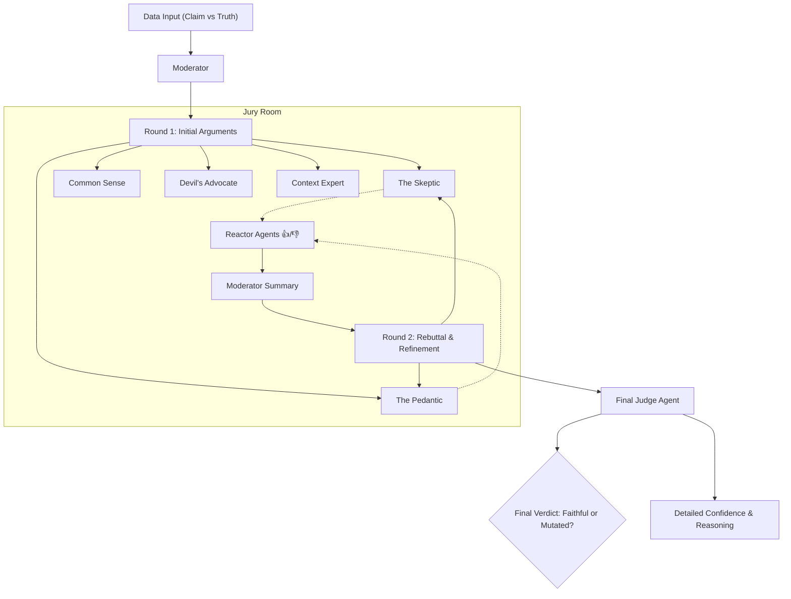
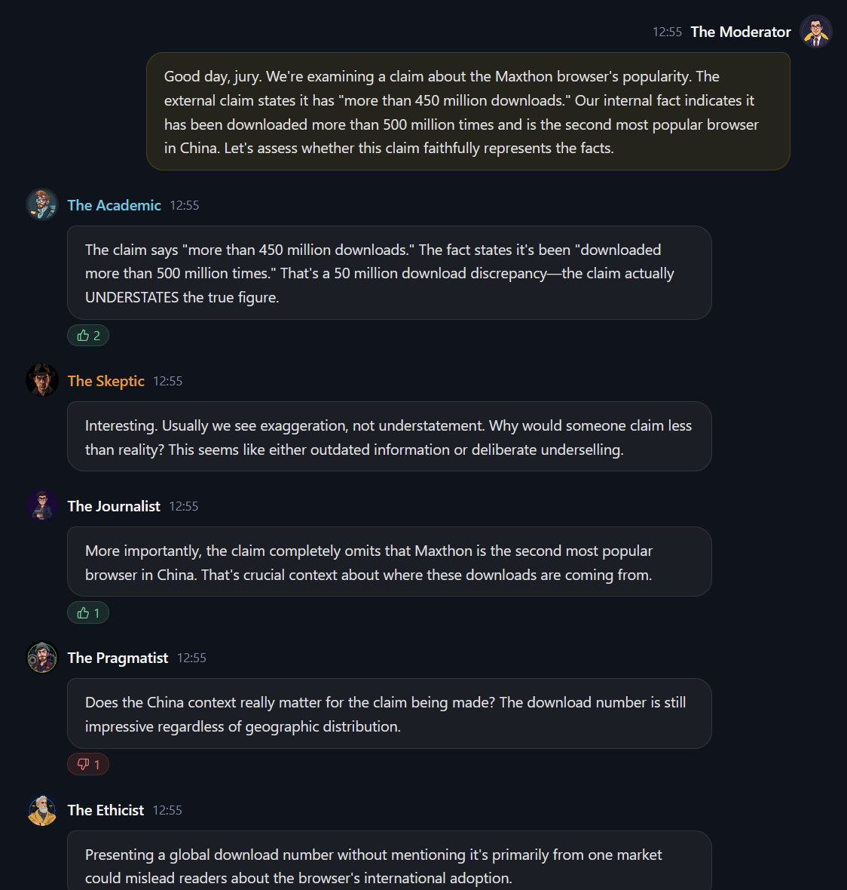

# FactTrace: The Agentic Consensus Jury ⚖️

> **Truth You Can Verify. AI You Can Trust.**

<div align="center">

[](https://www.python.org/)
[](https://openai.com/)
[](https://elevenlabs.io/)
[](https://github.com/FactTrace-Ltd/checker-of-claims)

**🏆 3rd Place Winner** at the [Cambridge DIS Hackathon](https://github.com/FactTrace-Ltd/cambridge-dis-hackathon) (Team Polaris)  
*Developed by Felix Burton, Dhruv Gupta, and Uras Asil*


</div>

---

## 🚩 The Challenge: "Faithful or Mutated?"
 
**Context:** This project was built for the [Cambridge DIS Hackathon](https://github.com/FactTrace-Ltd/cambridge-dis-hackathon), tackling the **Agentic Consensus Challenge**.

We were tasked with solving a critical problem in the age of AI misinformation: **determining if an external claim is a faithful representation of an internal ground truth.**

> *Is the headline sensationalized? Did the tweet strip away vital nuance? Is the summary actually accurate?*

A single "black box" LLM simply saying "True" or "False" is insufficient and opaque. The challenge was to build a system that could not only detect these mutations (distortions, exaggerations, missing context) but **explain its reasoning** through a transparent, agentic process.

---

## � The Solution: An Agentic Jury

**FactTrace** answers this challenge by deploying a **Multi-Agent Jury Debate System**.

Instead of a single AI deciding the truth, we engineered a **living, breathing jury of 5 unique AI agents**—each with a distinct persona, bias, and role—to debate the evidence, cross-examine claims, and reach a consensus.

### 🧠 The Jury of Agents

We utilized a modular agentic architecture to create a diverse ecosystem of reasoning:

| Agent Persona | Role | Personality |
|--------------|------|-------------|
| **The Skeptic** 🤨 | **Critic** | Challenges every assumption, looks for logical fallacies. |
| **The Pedantic Fact-Checker** 🧐 | **Analyst** | Obsessed with precision, numbers, dates, and exact wording. |
| **The Common Sense Judge** 🤷‍♂️ | **Pragmatist** | Considers how the "average reader" would interpret the claim. |
| **The Devil's Advocate** 😈 | **Contrarian** | Deliberately argues the opposite view to stress-test the consensus. |
| **The Context Expert** 🌐 | **Synthesizer** | Zooms out to identify what key context was left out. |

### 🤖 Advanced AI Integration

Our system goes beyond simple prompting. We implemented a complex orchestration layer:

*   **Recursive Debate Structure:** Agents don't just speak once. They listen, react, and refine their arguments in a multi-round format.
*   **Reactor Agents:** Dedicated "Reactor" sub-agents monitor the debate in real-time, providing "👍" or "👎" feedback on specific arguments, simulating a live audience or peer review.
*   **Moderator & Judge Separation:** To ensure fairness, we separated the **Moderator** (who guides the conversation) from the **Final Judge** (who delivers the verdict), preventing bias accumulation.
*   **Voice Integration (ElevenLabs):** We integrated **ElevenLabs** to give each juror a distinct, realistic voice, turning the text-based terminal output into a live, audible courtroom drama.

---

## ⚡ System Architecture



---

## 📸 Demo & Gallery

We designed the system to be visually and audibly impressive. Below are snapshots of the agents in action.

<div align="center">
  
  
</div>

<br/>

<div align="center">
  
  
</div>

---

## 🏃‍♂️ How to Run

1.  **Clone and Setup**:
    ```bash
    git clone https://github.com/FactTrace-Ltd/checker-of-claims.git
    cd checker-of-claims
    ```

2.  **Environment Setup**:
    ```bash
    # Create virtual environment and install dependencies
    ./run_hackathon.sh --help
    ```

3.  **Run a Debate**:
    ```bash
    # Run the full jury system on specific claims
    python -m checker_of_facts.hackathon_cli \
        --csv data/Polaris.csv \
        --count 1 \
        --premium
    ```

---

*Made with ❤️ by Team Polaris for the Cambridge DIS Hackathon 2025.*


